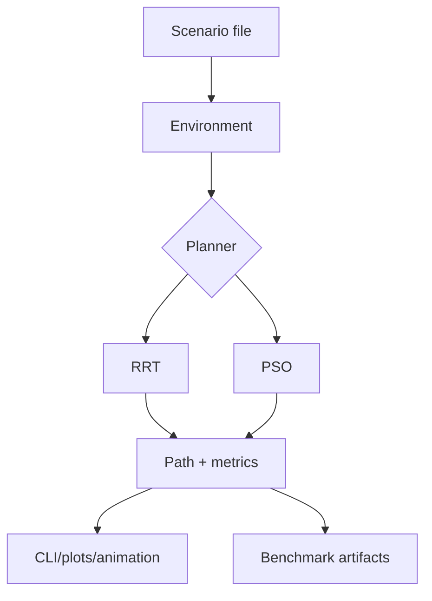

# Path Planning Benchmark Suite (PSO + RRT)


> Research-oriented 2D path planning framework comparing RRT and enhanced PSO variants under shared scenarios and benchmark protocols.

## Overview

This project studies 2D path planning in obstacle maps with two families of methods: RRT and PSO. Scenarios are loaded from text files and can be run in interactive mode or in batch benchmark mode.

The main contribution is the PSO variant comparison (reset, SA, DL, controlled cooling, pre-heat). The repository includes a reproducible tuning and benchmarking pipeline that logs metrics and generates plots.

The code and artifacts are organized for academic experimentation: same scenarios, repeatable runs, and comparable outputs across algorithms.

## Features

- CLI modes: RRT, multi-robot RRT, PSO.
- Seven PSO profiles: vanilla, RS, RS_SA_noCC, RS_SA_noCC_DL, RS_SA_CC, RS_SA_PH, RS_SA_CC_DL.
- Full pipeline: tune, benchmark, report, plot.
- Reproducible outputs: JSON, Parquet, CSV, PNG, GIF.
- Smoke tests for quick validation.

## Project Structure

```text
path_planing/
|- main.py                    # Main CLI (rrt, multi, pso)
|- make_pso_gif.py            # GIF export for PSO runs
|- run_rs_sa_ph_benchmark.py  # Example benchmark launcher
|- scenarios/                 # Scenario inputs (0..4)
|- src/
|  |- environment.py          # Map loading and collision checks
|  |- PSO/                    # PSO planner implementation
|  |- RRT/                    # RRT planner implementation
|  \- benchmark/              # Tune/benchmark/report/plot pipeline
|- tests/
|  \- test_smoke.py           # Quick sanity tests
|- requirements.txt           # pip dependencies
|- environment.yml            # conda environment
\- pyproject.toml            # metadata + Python version
```

## Installation

### Prerequisites

- Python 3.13 (from pyproject.toml)
- No mandatory system package is explicitly required

### Setup

```bash
# Enter the repository root
cd path_planing

# Option A (recommended): venv + pip
python -m venv .venv

# Windows PowerShell
.venv\Scripts\Activate.ps1

python -m pip install --upgrade pip
python -m pip install -r requirements.txt

# Optional: install dev dependency used by smoke tests
python -m pip install pytest
```

Alternative:

```bash
# Conda route
conda env create -f environment.yml
conda activate path_planning
```

## Usage

### Basic example

```python
from src.environment import Environment
from src.PSO.pso_solver import PSO
from src.PSO.pso_config import PSOConfig

env = Environment()
env.from_file("scenarios/scenario0.txt")

cfg = PSOConfig(number_of_particules=30, number_of_iterations=80)
planner = PSO(env, config=cfg)
planner.run(progress=False, verbose=False)

if planner.solution is not None:
    print("Path length:", planner.solution.total_length())
else:
    print("No solution found")
```

### CLI usage (if applicable)

```bash
# Main planner CLI
python main.py --help
python main.py rrt --scenario 0
python main.py multi --scenario 1 --animate multi_robot.html
python main.py pso --heuristic sa_ph --runs 5 --scenario 2 --animate pso.html

# Unified benchmark CLI
python -m src.benchmark --help
python -m src.benchmark run --algo RS_SA_PH --scenarios 0 1 2 3 4 --runs 100 --exp-id exp01
python -m src.benchmark tune --algo RS_SA_PH --n-iter 50
python -m src.benchmark benchmark --algo RS_SA_PH --runs 50

# Pipeline dry-run (safe command planning)
python -m src.benchmark run --algo RS --scenarios 0 --runs 1 --init-points 1 --n-iter 1 --dry-run

# GIF export utility
python make_pso_gif.py --scenario 0 --algo RS_SA_PH --max-runs 20 --fps 10

# Smoke tests
python -m pytest tests/test_smoke.py -q
```

## Configuration

No environment variable is required by default.

- Scenario files: scenarios/scenarioN.txt (map size, starts/goals, radius, obstacles)
- PSO parameters: src/PSO/pso_config.py (swarm size, iterations, SA/cooling, reset, weights)
- Pipeline defaults: src/benchmark/core/config.py (runs, tuning budget, penalties, parallelism)
- Algorithm profiles: src/benchmark/core/algo_profiles.py (flags + search spaces)

## Methodology / How it works

1. Load a scenario into Environment.
2. Run a planner:
   - RRT: tree expansion + rewiring (+ optional smoothing)
   - PSO: swarm optimization with configurable heuristics
3. Compute metrics (fitness, collisions, path length, runtime).
4. In benchmark mode: tune hyperparameters, run repeated evaluations, generate reports/plots.



## Results

Outputs are written to src/benchmark/artifacts/exp_id/:

- tuning/: tuning_summary.json + tuning curves
- benchmark/: benchmark_summary.json + benchmark_runs.parquet + comparison_table.csv
- logplots/: diagnostic and comparison figures

Main evaluation criteria:

- collision-free rate
- best fitness and path length
- runtime

## Dependencies

From requirements.txt:

- matplotlib
- shapely
- plotly
- tqdm
- rich
- pandas
- pyarrow
- bayesian-optimization
- joblib
- seaborn
- optuna
- pillow

From pyproject.toml:

- runtime dependencies: none declared
- dev dependencies: pytest>=9.0.2

From environment.yml (conda route):

- conda: numpy, python=3.11, matplotlib, shapely, tqdm, plotly, pandas, pyarrow
- pip: pygame, scipy, bayesian-optimization, seaborn

## Authors & Acknowledgements

[Your Name] - [Institution] - [Year]

## License

MIT
